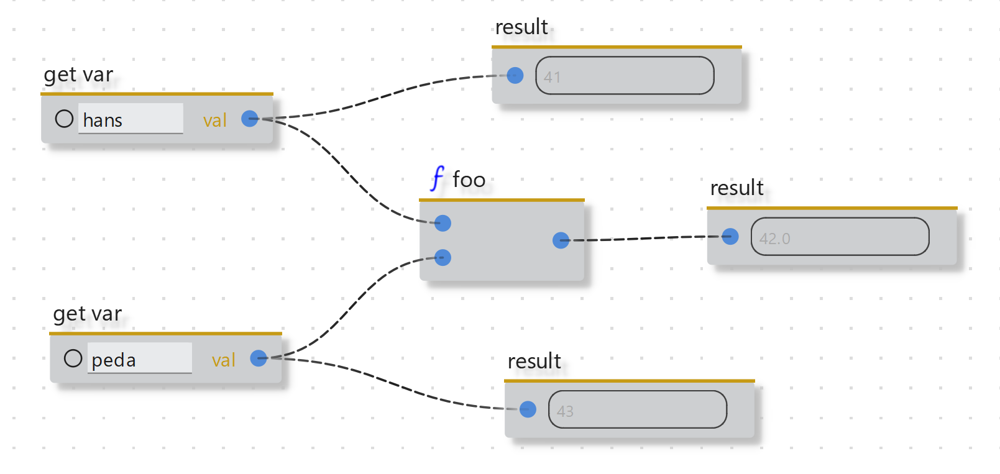

  

<h1 align="center"> Welcome to the ryvencore-qt documentation! </h1>

<!--  -->

<!-- Looking for a quick start? Visit the [Getting Started](/getting_started.md) section. -->

## Project Idea

The true power of flow-based visual scripting lies in optimization towards specific domains. While [Ryven](https://github.com/leon-thomm/ryven) is meant as a general purpose editor, `ryvencore-qt` can be used to create editors that work fundamentally similar but which can be modified and optimized. It is an easy to use framework for creating flow-based visual scripting editors for Python with Qt. For a list of features, see [Features](/features). `Ryven` is now based on this project and the development of `ryvencore-qt` is currently closely tied to `Ryven`.

### Future

Technically, `ryvencore-qt` is a Qt frontend for `ryvencore`, the backend, which might get its own repository once the API is solid enough and other frontends can be developed. Attempts to bring parts of this to the web by creating a `ryvencore-qt` equivalent for the browser are being discussed. If you want to contribute to that, please hit me up.

> [!WARNING]
> `ryvencore-qt` is not a professional piece of software and sometimes there are major changes. It is in very early stage, and be aware that future versions might not be fully backwards compatible. If you have suggestions for improvement of the software, feel free to open discussions.

Besides essential GUI classes, `ryvencore-qt` also provides a few convenience GUI classes which only use `ryvencore`'s public API, making it a little easier to get started.

There is a precise definition of the fundamental characteristics of the flows in the [Features](features.md) section.

## Resources

May I also point to the [website of the Ryven project](https://ryven.org) if you haven't been there already. And there's a small [YouTube channel](https://www.youtube.com/channel/UCfpqNAOXv35bj_j_E_OyR_A). How about a Discord server in the future?